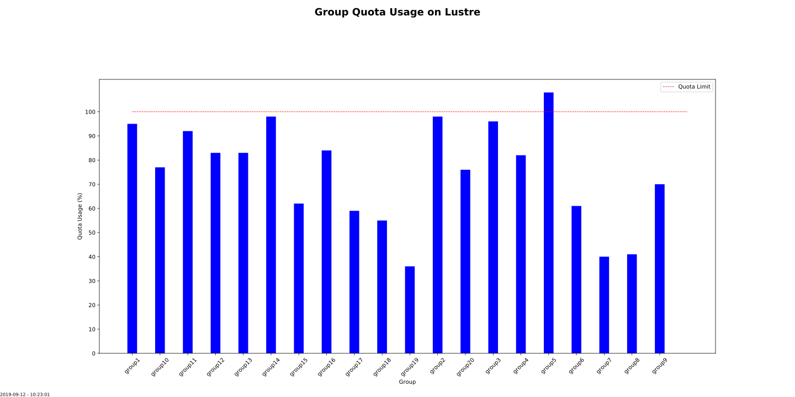
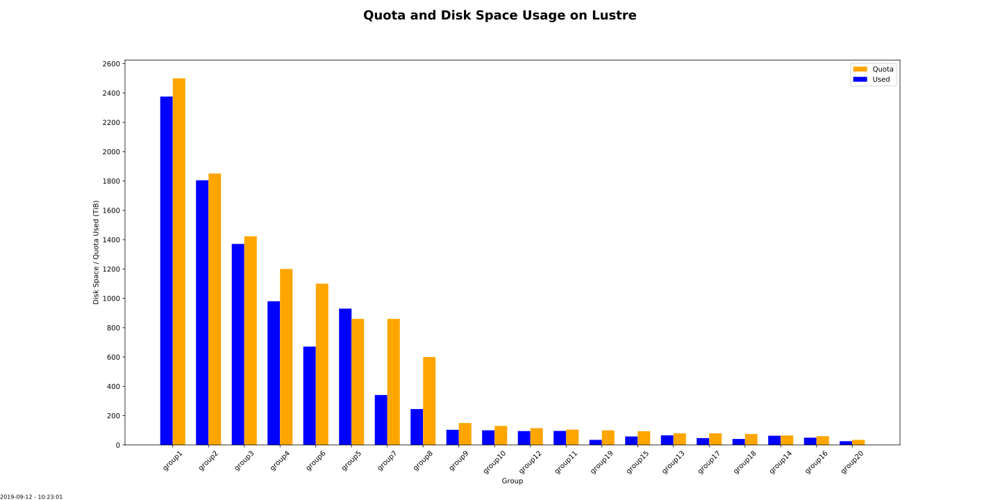
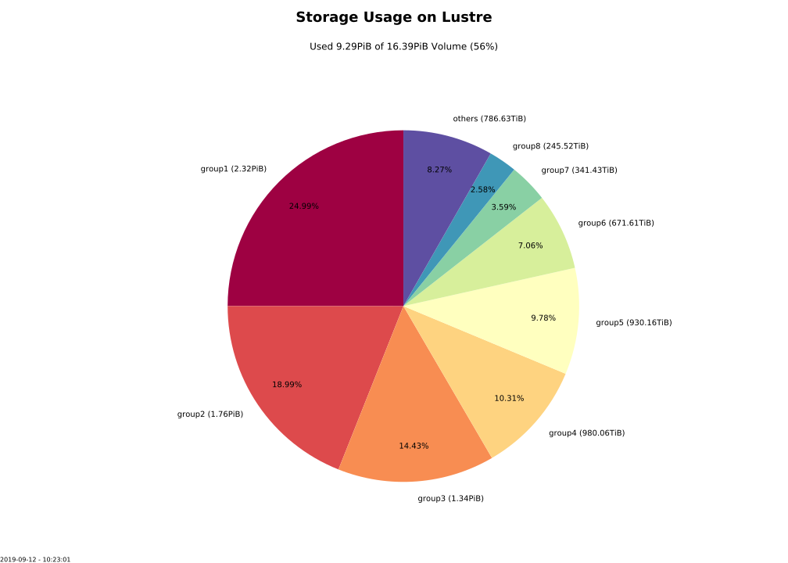
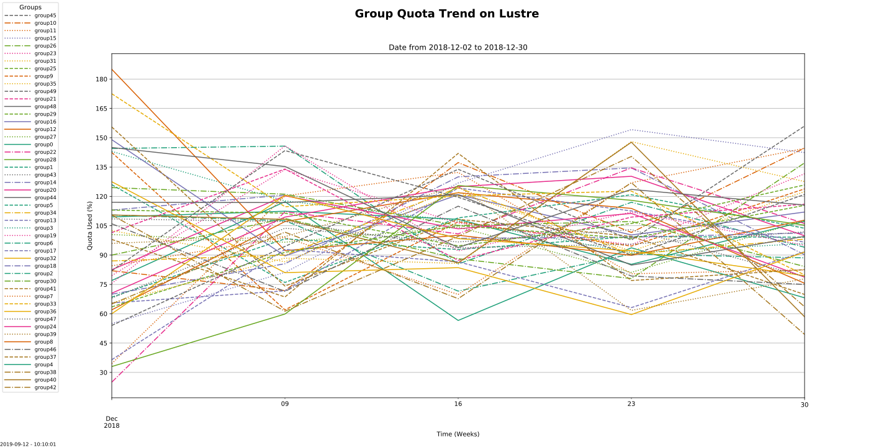
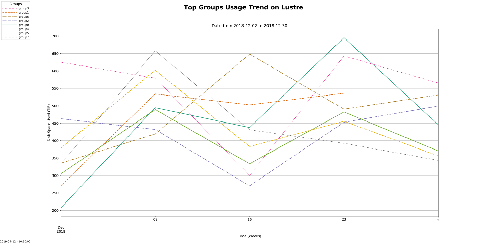

# Report Generator

## Prerequisite

**Required**:  
* python36 - Python runtime
* matplotlib (3.1.1) - for plotting
* pandas (0.25.1) - for time series plots

**Optional**:  
* pip3 - installation of Python packages
* mysqlclient (1.4.4) - collecting and retrieving data from MySQL-DB
* getent - group resolution
* lfs quota - determining Lustre FS group quotas

### Build Tools Dependencies

__Python__:  

* python36-devel

__mysqlclient:__  

* gcc
* MariaDB-devel
* MariaDB-shared

## Executables

### Lustre Reports

#### Collect Scripts

* lustre-group-quota-collect.py

#### Report Scripts

* lustre-weekly-reports.py
* lustre-monthly-reports.py
* lustre-migration-report.py

## Dependency Matrix

**TODO** - which component depends on what module

## Report Examples

#### Snapshot Plots

Example for **QuotaPctBarChart** class  
Shows percentage quota usage for each group:  
  

Example for UsageQuotaBarChart class.  
Shows disk usage and quota consumption for each group:  

Esxample for UsagePieChart class.  
Shows usage pie with storage consumption of top groups:  

#### Time Series Plots

Examples for TrendChart class.  

Shows treand for quota consumption of all groups:  

Shwos treand for disk space usage of top groups:  

